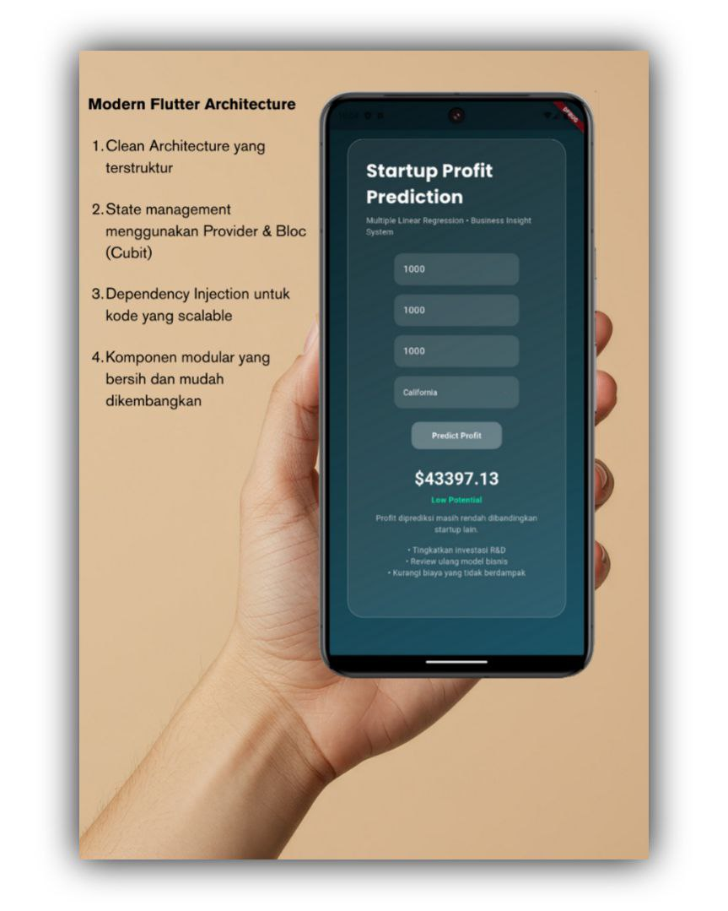

# Flutter Clean Architecture Template

Project ini menggunakan pendekatan Clean Architecture untuk membangun aplikasi yang scalable, maintainable, dan mudah diuji. Struktur sudah disiapkan untuk kebutuhan production dan kolaborasi tim.

---

## Overview

Aplikasi dibagi menjadi tiga layer utama:

presentation → domain → data

Setiap layer memiliki tanggung jawab yang jelas dan aturan dependency yang ketat.

---

## Project Structure

lib/

- core/
- features/
- shared/
- injection/

Penjelasan singkat:

- core: logic global dan infrastructure
- features: module berdasarkan fitur
- shared: komponen reusable
- injection: dependency injection setup

---

## Architecture Principles

1. Separation of concerns  
   Setiap layer memiliki tanggung jawab masing-masing

2. Dependency rule
   - presentation → domain
   - data → domain
   - domain tidak bergantung ke layer lain

3. Feature-based structure  
   Setiap fitur dipisahkan agar mudah dikembangkan

4. Reusability  
   Komponen umum ditempatkan di shared dan core

---

## Data Flow

Alur data dalam aplikasi:

UI → Usecase → Repository → Datasource → API

Dan kembali:

API → Datasource → Repository → Entity → UI

---

## Key Rules

- Tidak ada API call langsung dari UI
- Semua business logic harus berada di usecase
- Domain harus pure (tidak bergantung ke Flutter atau API)
- Tidak boleh ada duplikasi network di feature
- Feature tidak boleh saling bergantung langsung

---

## Adding New Feature

Langkah umum:

1. Buat folder baru di:
   features/nama_feature/

2. Tambahkan struktur:
   - data/
   - domain/
   - presentation/

3. Implementasi sesuai layer

4. Daftarkan dependency di injection

---

## Documentation

Detail dokumentasi tersedia di:

- lib/README.md
- lib/core/README.md
- lib/features/README.md
- lib/shared/README.md
- lib/injection/README.md

---

## Goals

Struktur ini dirancang untuk:

- memudahkan scaling aplikasi
- menjaga konsistensi kode
- mempermudah testing
- mempercepat onboarding developer baru

## Screenshots

Berikut beberapa tampilan aplikasi:

  
  
  
  

  

